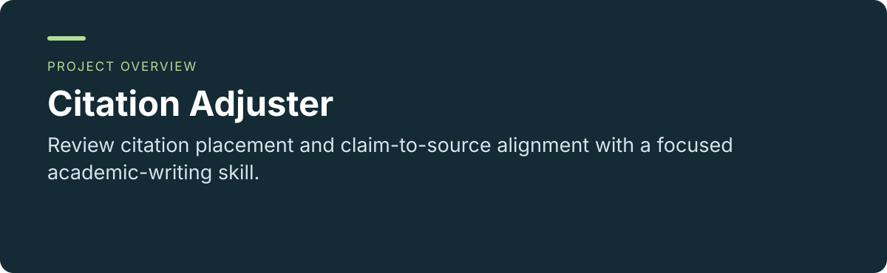
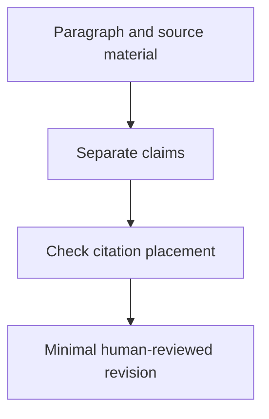

<p align="center"></p>

<p align="center"><a href="README.md"></a> <a href="README.zh-CN.md"></a></p>

# Citation Adjuster

**Review citation placement and claim-to-source alignment with a focused academic-writing skill.**

[Project usage and maintenance](../README.md) · [Report an issue](https://github.com/thejaytang/citation-adjuster/issues)

## 1. What you can do

- Flag citation dumping while preserving legitimate multi-source synthesis.
- Suggest minimal revisions without adding unverified references.


## 2. Start here

Use this focused skill for citation placement. For bibliography matching and Zotero workflows, the project recommends [supercite-through-zotero](https://github.com/thejaytang/supercite-through-zotero).

```text
Use $citation-adjuster to review this literature-review paragraph.
Keep legitimate source clusters and do not add references.
```

## 3. Use cases

These are illustrative scenarios. Only explicitly linked execution artifacts represent checks performed for this update.

| Input or request | Expected result |
|---|---|
| A paragraph with several claims and citations | Local placement issues and a minimal revision |
| A literature-review synthesis | A check of how each source contributes |



## 4. Requirements and current limits

Requires an agent host that can load the skill. It cannot verify source support without source content and does not fabricate missing references. Keep this as a focused option; use the recommended related project for the broader citation/reference workflow.

## 5. Documentation and sources

These links identify the implementation, operating instructions or related projects for a closer fit check.

- [Project guide](../README.md)
- [Skill instructions](../SKILL.md)
- [Broader Zotero workflow](https://github.com/thejaytang/supercite-through-zotero)

## 6. License and maintenance

No repository-wide license is declared at the root. This presentation update does not change the terms of code, data or third-party material; confirm permission for the material you want to reuse.

This is the public introduction. Linked project documents remain authoritative for operation, constraints and maintenance. Presentation updated: 2026-09-22.
