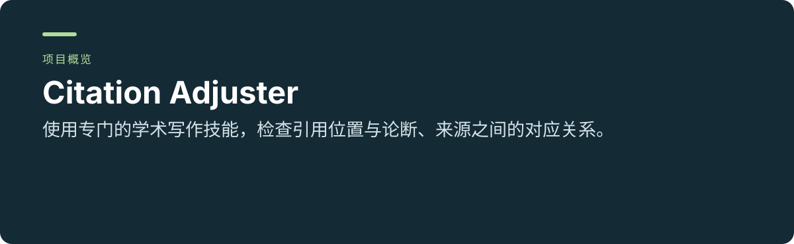
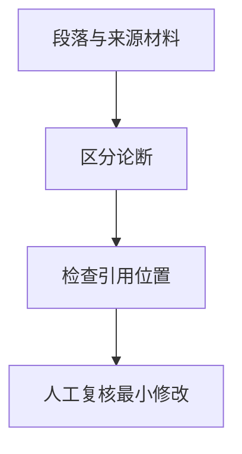

<p align="center"></p>

<p align="center"><a href="README.md"></a> <a href="README.zh-CN.md"></a></p>

# Citation Adjuster

**使用专门的学术写作技能，检查引用位置与论断、来源之间的对应关系。**

[项目使用与维护入口](../README.md) · [报告问题](https://github.com/thejaytang/citation-adjuster/issues)

## 1. 能完成什么

- 指出引用堆砌，同时保留合理的多来源综合。
- 给出最小修改建议，不增加未经核实的参考文献。


## 2. 从这里开始

仅检查引用位置时可以使用此技能；如需文献表匹配和 Zotero 流程，本项目建议使用 [supercite-through-zotero](https://github.com/thejaytang/supercite-through-zotero)。

```text
Use $citation-adjuster to review this literature-review paragraph.
Keep legitimate source clusters and do not add references.
```

## 3. 使用场景

以下为说明性场景；只有明确链接的运行产物才代表本次检查结果。

| 输入或请求 | 预期结果 |
|---|---|
| 含多项论断与引用的段落 | 局部引用位置问题与最小修改稿 |
| 文献综述综合段落 | 各来源作用的对应检查 |



## 4. 使用条件与当前边界

需要能够加载技能的 Agent 宿主。缺少来源内容时不能证明引用支持论断，也不能虚构缺失文献。该技能适合聚焦引用位置；完整引文与参考文献流程应使用推荐的相关项目。

## 5. 资料与来源

下面链接指向实现、操作说明或相关项目，便于进一步判断适用性。

- [项目指南](../README.md)
- [技能指令](../SKILL.md)
- [更完整的 Zotero 流程](https://github.com/thejaytang/supercite-through-zotero)

## 6. 许可与维护

仓库尚未在根目录声明统一许可证；本次展示更新没有改变代码、数据或第三方材料的许可。复用前请确认对应材料的授权。

本页为对外介绍。具体操作、约束和维护说明以链接的项目文档为准。展示页更新：2026-09-22。
